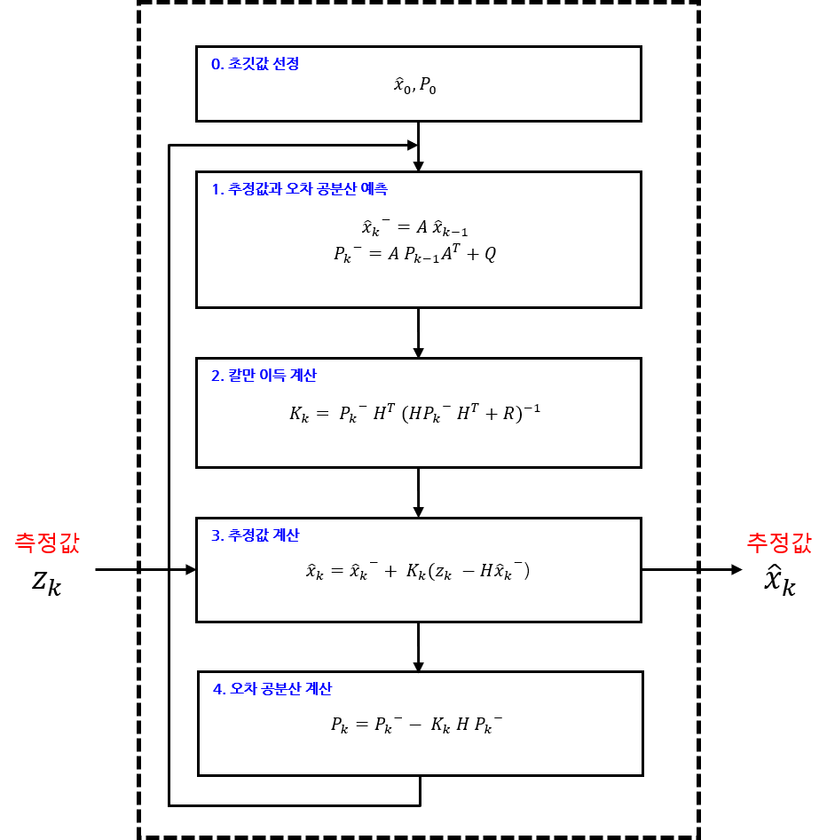
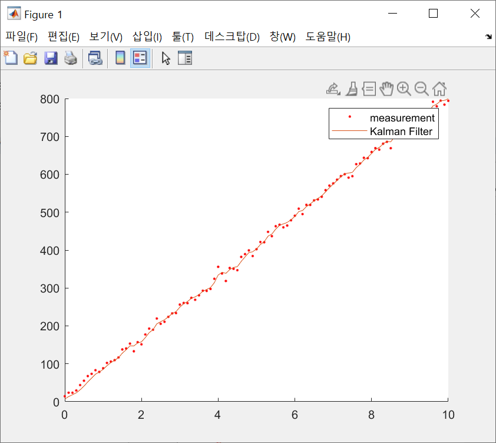

# 2주차 현장실습

### <u>1. 칼만 필터의 이해</u>


#### 1.1 평균 필터

$$
x_k = \frac{x_1+x_2+\cdot\cdot\cdot + x_k}{k}
$$

평균은 데이터의 총합을 데이터 개수로 나눈 값을 말한다. 평균 같은 경우 데이터가 하나 더 추가된다면 모든 데이터를 다시 더한 후 k+1로 나눠야한다. 

그래서 재귀식으로 나타내었다. 
$$
\overline{x_k} = \frac{k-1}{k}x_k+ \frac{1}{k}x_k
$$


#### 1.2 이동평균 필터

평균을 취하면 측정 데이터에서 잡음을 제거할 수 있다. 하지만 측정하려는 물리량이 시간에 따라 변하는 경우, 평균을 취하는 건 적절하지 않다. 평균은 데이터의 동적인 변화를 모두 없애버리고 측정 데이터를 뭉뚱그려 하나의 값만 내놓기 때문이다,

잡음을 없애는 동시에 시스템의 동적인 변화를 반영하는 방법이 이동평균 필터이다. 
$$
\overline{x_k} = \overline{x_{k-1}} + \frac{x_k-x_{k-n}}{n}
$$

- 이동평균에서는 평균 계산에 동웒는 데이터 개수(n)를 잘 선정해야 한다. 이 값이 잡음 제거와 변화 민감성이라는 상충된 요구를 절충하는 역할을 한다. 
- 측정하는 물리량이 빠르다면 이동평균의 데이터 개수를 줄여 변화를 빨리 쫓아가야한다.
- 측정하는 물리량이 느리다면 데이터 개수를 늘려 잡음 제거 특성을 높여야한다.


단점

- 식을 보면 모든 데이터에 동일한 가중치(1/n)를 부여한다. 가장 최근의 데이터와 가장 오래된 데이터를 같은 비중으로 평균에 반영한다. 이동평균 필터를 변화가 심한 신호에 적용하면, 잡음 제거와 변화 민감성을 동시에 달성하기 어렵다. 


#### 1.3 저주파 통과 필터

저주파 통과 필터는 이름 그대로 저주파 신호는 통과시키고 고주파 신호는 걸러내는 필터를 말한다.
대개 측정하려는 신호는 저주파이고 잡음은 고주파 성분으로 되어 있어 잡음 제거용으로 많이 쓰인다.
$$
\overline{x_k} = \alpha\overline{x}_{k-1}+ (1-\alpha)x_k
$$

- a값이 작으면 추정값 계산에 측정값이 더 많이 반영되는 거다. 이렇게 되면 저주파 통과 필터는 잡음 제거보다는 측정값의 변화에 더 민감해진다. 그래서 잡음이 더 많은 것이다. 	
- a값이 커지면 추정값의 비중이 더 커져서 결과적으로 추정값이 직전 추정값과 별로 달라지지 않게 되는 샘이다. 그래서 잡음이 줄어들고 추정값 그래프의 변화가 무뎌진다.

$$
\overline{x}_{k-1} = \alpha\overline{x}_{k-2}+ (1-\alpha)x_{k-1}
$$

위에서 봤던 평균 필터의 식과 비슷하지만 같지 않다. XkBar는 평균값이 아닌 추정값(estimated value)이다. 
여기서 a는 0<a<1인 임의의 상수이다. 
$$
\overline{x}_k=α\overline{x}_{k−1}+(1−α)x_k
$$

$$
=α [{α\overline{x}_{k-2}+(1−α)x_{k−1}}]+(1−α)x_k
$$

$$
=α^2{\overline{x}_{k-2}+α(1−α)x_{k−1}}+(1−α)x_k
$$

여기서 측정데이터 Xk-1, Xk이 곱해진 계수의 크기를 비교하였을 때 이전값보다 최근 측정값이 더 큰 가중치를 부여 받아 추정값에 반영되고 있음을 알 수 있다. 


#### 1.4 칼만 필터



위와 같이 입력과 출력이 하나씩인 아주 간단한 구조로, 측정값 (Zk)이 입력되면 내부에서 처리한 다음 추정값을 출력한다. 내부 계산은 총 네 단계에 걸쳐 이뤄진다.

- I 단계에서는 예측 단계이다. II~IV단계에서 계속 사용하는 추정값과 오차 공분산을 계산한다. 위첨자 '-'는 예측값을 의미한다. 

- II 단계에서는 칼만 이득(Kk)을 계산한다. H와 R은 칼만 필터 알고리즘 밖에서 미리 결정되는 값이다.

- III 단계에서는 입력된 측정값(센서로 측정한 값)으로 추정값을 계산한다. 

- IV 단계에서는 오차 공분산을 구하는 단계이다. 오차 공분산은 추정값이 얼마나 정확한지를 알려주는 척도로 사용된다. 
- IV 단계에서 구한 오차 공분산은 Pk값은 I 단계에서 Pk-1값으로 들어간다. 
- 
- 


위에서의 A, H, Q, R은 시스템 모델로 이미 정해진 값이다.

4개의 시스템 모델 값을 어떻게 선정하느냐에 따라 칼만 필터의 성능이 달라지게 된다.

칼만 필터는 시스템 모델이 실제 시스템과 가까울수록 좋아진다. 

- A, H는 State Space Equation(상태 공간 방정식)이다.


#### 1.5 칼만 필터 예측 과정

직전 추정값 (x^k-1)과 오차 공분산(Pk-1)이 입력되면 최종 결과로 예측값 (x^-k, Pk)을 내놓는다. 이 값들은 추정 과정에서 사용되고, 이 단계에서 사용하는 시스템 모델 변수는 A와 Q이다.


예측 과정에서는 시각이 Tk에서 Tk+1으로 바뀔 때, 추정값 X^k가 어떻게 변하는지를 추측한다. 즉 현재 시각의 추정값이 다음 시각 Tk+1에서는 어떤 값이 될지를 예측해 보는 거다. 

#### 1.6 칼만 필터 추정 과정

칼만 필터 알고리에서 II~IV단계가 여기에 속한다. 추정 과정의 결과물은 추정값(X^k)과 오차 공분산(Pk)이다. 입력값으로는 예측 과정의 예측값 (X^-k, P^-k) 뿐만 아니라, 측정값 (Zk)을 전달 받아 사용한다. 이 단계에서 사용하는 시스템 모델 변수는 H와 R이다. 


정리하자면 

```
1, 시스템 모델 (A, Q)을 기초로 다음 시각에 상태와 오차 공분산이 어떤 값이 될지를 예측한다.
							X^-k, P-k
							
2. 측정값과 예측값의 차이를 보정해서 새로운 추정값을 계산한다. 이 추정값이 칼만 필터의 최종 결과물이다.
							X^k, Pk
							
3. 위의 두 과정을 반복한다. 	
```


<u>추정 과정을 이해하기 위해 저주파 통과 필터와 관련지어 설명하겠다.</u>

**II단계(칼만 이득 계산)에서 III단계(추정값 계산)에 대해 설명하겠다.**

- III단계에서의 추정값을 계산하는 식을 따로 떼어내어 보겠다.

$$ {//}
\widehat{x}_k = \widehat{x}^-_k + K_k(z_k-H\widehat{x}^-_k)
$$

- 1차 저주파 통과 필터와 칼만 필터이다. 식이 매우 비슷하다. 계산을 쉽게 하기 위해서 H 행렬을 단위행렬로 가정하고 식을 정리하였다. 

$$
\overline{x}_k = a\overline{x}_{k-1} + (1-a)x_k
$$

$$
\overline{x}_k = (1-K)\overline{x}_{k-1} + (1-(1-K))x_k
$$

$$
\overline{x}_k = (1-K)\overline{x}_{k-1} + Kx_k
$$

$$
\widehat{x}_k = (1-K_k)\widehat{x}^-_k + K_kz_k
$$

- 1차 저주파 통과 필터는 직전 추정값과 측정값에 가중치를 부여한 후 더해서 추정값을 계산한다. 칼만 필터 또한 예측값(X^-k)과 측정값(Zk)에 적절한 가중치를 곱한 다음, 두 값을 더해서 최종 추정값을 계산한다. 

- 칼만 필터 식에서 우리가 이제 유일하게 모르는 값은 Kk 즉 칼만 이득이라고 불리는 변수인데, 이 값만 알면 새로운 추정값을 계산해낼 수 있다. 이 칼만 이득의 경우 II단계에서 계산한다. 

- 결국 칼만 필터는 1차 저주파 통과 필터와 비슷한 방식으로 추정값을 계산한다. 그런데 가중치를 조정하는 칼만 이득은 고정되어 있지 않고, 일정한 공식에 따라 매번 새로 계산된다. 


**IV단계(오차 공분산 계산)에 대해 설명하겠다.** 

- $$
  x_k \sim  N(\widehat{x}_k, P_k)
  $$

  이 식은 변수 Xk가, 평균이 Pk인 정규 분포를 따른다는 뜻이다. 폭은 Pk가 결정을 하는데 Pk가 추정값의 오차를 나타낸다는 것이 이해가 간다. Pk의 값이 작으면 Xk가 가질수 있는 값이 대부분 평균 근처에 모여 있다는 것이고, Pk의 값이 크면 Xk가 가질 수 있는 값의 범위도 넓어져 추정 오차도 커지게 된다. 
  
- $$
  P_k = P_k^- - K_kHP_k^-
  $$

  이 식도 특별히 주목해야 할 내용은 없다. 그냥 공식대로 오차 공분산을 계산해서 예측 과정으로 넘겨 주면 된다. 

- 중요한 것은 **추정값이 정확한지 아닌지를 오차 공분산으로 판단할 수 있다는 사실이다.** 오차 공분산은 칼만 필터의 추정값이 실제 참값과 얼마나 차이가 나는지를 보여주는 척도가 된다. Pk가 크면 추정 오차가 크고 Pk가 작으면 추정 오차도 작다. 


#### 1.7 시스템 모델

- 시스템 모델이란 우리가 다루는 문제를 수학식으로 표현해 놓은 것. 
- 시스템 모델을 모델링 및 유도하는 것이 어려운 일
- 이 장에서는 칼만 필터의 시스템 모델이 어떤 형태를 가져야하는지, 시스템 모델이 칼만필터 알고리즘에 어떻게 이용되는지 설명

$$
x_k = Ax_{k-1} + w_k
$$

$$
z_k = Hx_k + v_k
$$


##### 변수정의

- xk : 상태변수, (n * 1) 열 벡터 (거리, 속도, 무게 등 우리가 관심있는 물리적 변수)
- zk : 측정값, (m * 1) 열 벡터
- A : 시스템행렬, (n * n) 행렬 (시간예 따라 시스템이 어떻게 움직이는지 나타냄)
- H : 출력행렬, (m * n) 행렬 (측정값에 각 상태변수가 어떻게 반영되어 있는지 규정)
- wk : 시스템잡음, (n * 1) 열벡터 (시스템에 유입되어 상태변수에 영향을 주는 잡음)
- vk : 측정잡음, (m * 1) 열벡터 (센서에서 유입되는 측정잡음)

- 칼만필터에서 잡음은 중요한 역할, 모든 잡음을 [백색잡음](https://ko.wikipedia.org/wiki/백색_소음)으로 가정
- A와 H는 모든 성분이 상수인 행렬


##### 잡음의 공분산

- 잡음 신호는 다음에 어떤 값이 나올지 예측할 수 없고, 순전히 통계적인 추정만 가능 (= 잡음을 표현할때는 통계학 이용)

- 칼만 필터에서 잡음은 평균이 0인 정규분포 따른다고 가정하므로, 잡음의 분산만 알면 됨.

- Q : wk의 공분산 행렬, (n * n) 대각행렬

- R : vk의 공분산 행렬, (m * m) 대각행렬

- 공분산 행렬은 변수의 분산으로 구성된 행렬로 정의

- $$
  Q = \begin{bmatrix}
  \ \sigma^2_1  &  0&  ...& 0\\ 
   0&  \sigma^2_2&  ...& 0\\ 
   \vdots &\vdots &\ddots& \vdots\\
   0&  0&  ...& \sigma^2_n
  \end{bmatrix})
  $$

- Q와 R은 잡음 특성 정확히 반영해서 구성하는게 원칙이지만, 여러 오차의 복합적 작용으로 해석적 결정에는 한계 있음

- 잡음에 대한 지식을 최대한 활용하되, 두 행렬을 칼만필터의 설계인자로 보고 시행착오 과정을 통해 보정하며 적절한 값 찾아야 함

- 적절한 값을 찾는 기준

  - 행렬 Q와 R이 사용되는 지점

- 칼만 이득 계산식 (행렬 R 사용)
  - R이 커지면 칼만이득이 작아짐
  - 칼만이득이 작아지면 측정값보다 예측값의 반영비율이 높아짐
  - 측정값의 영향을 덜 받고 변화가 완만한 추정값을 얻고 싶다면, 행렬 R을 키우면 됨

1. 오차 공분산의 예측값 계산식 (행렬 Q 사용)
   - Q가 커지면 오차공분산 예측값도 커짐
   - 오차공분산 예측값이 커지면 칼만이득도 커짐
   - 측정값의 영향을 덜 받고 변화가 완만한 추정값을 얻고 싶다면, 행렬 Q를 줄이면 됨 (R과 반대)


#### 1.8 칼만 필터 예제

```
손칼만 연구원은 요즘 신형 열차의 성능 시험으로 바쁘다. 시험 내용은 직선 선로에서 열차가 80m/s의 속도를 유지하는지 확인하는 것이다. 위치와 속도 정보는 0.1초 간격으로 측정해서 저장하도록 되어 있다.

그런데 시험 결과를 살펴보던 손칼만 연구원의 얼굴이 갑자기 사색으로 변했다. 속도 데이터가 모두 0으로 찍혀 있는 게 아닌가! 실험에 드는 비용과 시간이 만만치 않았는데, 이 사실을 위에서 알면 난리가 날게 뻔하다. 그나마 다행인 것은 위치 정보는 이상이 없어 보인다는 점이다. 우리의 손칼만 연구원을 이 위기에서 구해 낼 방법은 없을까?
```

칼만 필터는 측정 잡음을 제거하는 것 뿐만 아니라 측정하지 않은 값을 예측할 수 있다.

이 문제에 대해 우리가 관심 있는 물리량은 열차의 위치와 속도이므로 이 두 변수를 상태 변수로 정의한다. 
$$
x =\binom{위치}{속도}
$$
시스템 모델을 정의하였다.
$$
\begin{align}
x_{k+1} = Ax_k + w_k
\\z_k = Hx_k + v_k
\\A = \begin{bmatrix}
1 & \triangle{t}\\ 
0 & 1 
\end{bmatrix}
\\H = \begin{bmatrix}
1 & 0
\end{bmatrix}
\end{align}
$$
여기서 △ t는 위치를 측정하는 시간 간격을 의미한다. 

시스템 모델에 대입해서 상태 변수 관계식을 풀어봤다.
$$
\begin{align}
\begin{bmatrix}
위치\\ 
속도
\end{bmatrix}_{k+1}= \begin{bmatrix}
 1& \bigtriangleup t\\ 
 0& 1
\end{bmatrix}\begin{bmatrix}
위치\\속도 
\end{bmatrix}_k + \begin{bmatrix}
0\\ 
w_k
\end{bmatrix} =
\begin{bmatrix}
위치 + 속도 \cdot \bigtriangleup t \\ 
속도 + w
\end{bmatrix}_k
\end{align}
$$


**위치 관계식**

이 식은 '현재 위치 = 직전 위치 =+ 이동 거리' 라는 물리 법칙을 수식으로 표현한 것이다.
$$
위치_{k+1} = 위치_k + 속도_k \cdot \bigtriangleup t
$$


**속도 관계식**
이 식이 의미하는 바는 열차 속도는 시스템 잡음(Wk)의 영향만 받을 뿐, 다른 외부의 힘은 작용하지 않는다는 것이다. 속도가 일정하다는 말이다. 여기서 시스템 잡음은 마찰, 엔진 제어기의 오차 등 열차 속도에 영향을 주는 모든 요인의 합을 의미한다. 
$$
속도_{k+1} = 속도_k + w_k
$$
우리 미사일 예제의 경우, 똑같이 알 수 없는 기동을 할 수도 있는 등 여러 오차 오인이 있을 것이기 때문에 가우시안 화이트 노이즈를 추가해야할 것이다. 


**시스템 모델의 측정값 관계식**
$$
\begin{align}
z_k = Hx_k + v_k\\
z_k= \begin{bmatrix}
1 & 0
\end{bmatrix}
\begin{bmatrix}
위치\\
속도 
\end{bmatrix}_k + v_k\\
z_k = 위치_k + v_k
\end{align}
$$
이 식이 의미하는 바는, 측정값은 위치뿐인데, 이 측정값에 잡음이 섞여 있다는 것이다. 

```
시스템 모델 값 A,H는 시스템의 물리적인 관계를 모델링한 결과물이다. 

측정 잡음(vk)의 오차 특성은 센서 제작사에서 제공하는 경우가 많다. 그렇지 않다면 실험과 경험을 통해 결정해야 한다.

시스템 잡음 (wk)의 모델링은 시스템에 대한 지식과 경험에 의존해야 한다.

공분산 행렬 (Q,R)을 논리적으로 구하기 어렵다면 두 행렬을 칼만 필터의 설계 인자로 보고 시행착오를 거쳐 선정하는 것도 한 방법이다.
```


마지막으로 잡음의 공분산 행렬 (Q,R)만 결정하면 시스템 모델의 유도는 끝난다. 이 예제에서는 두 잡음이 다음과 같은 특성을 갖는다고 가정한다. 
$$
Q = \begin{bmatrix}
 1& \bigtriangleup t\\ 
 0& 1
\end{bmatrix}, R = 10
$$


**위 예제의 칼만 필터의 알고리즘**

DvKalman(z) : 칼만 필터 함수

- 매개변수 : z(위치 측정값)
- 반환값 : 위치 추정값, 속도 추정값

```matlab
function [pos, vel] = DvKalman(z)
%
%
persistent A H Q R 
persistent x P
persistent firstRun


if isempty(firstRun)			% 초기값 설정
  firstRun = 1;
  
  dt = 0.1;					
  
  A = [ 1 dt;					% 시스템 모델 변수 초기화 Start
        0 1  ];
  H = [ 1 0 ];
  
  Q = [ 1 0;
        0 3 ];
  R = 10;						% 시스템 모델 변수 초기화 End

  x = [ 0 20 ]';				% 초기 예측값 설정
  P = 5*eye(2);   				% 초기 예측값 설정 [5 0, 0 5]
end

  
xp = A*x;  						%I. 	추정값 예측
Pp = A*P*A' + Q;    			%   	오차 공분산 예측

K = Pp*H'*inv(H*Pp*H' + R);		%II.	칼만 이득 계산

x = xp + K*(z - H*xp);			%III. 	추정값 계산
P = Pp - K*H*Pp;   				%IV.	오차 공분산 계산

  
pos = x(1);					    %계산된 위치 추정값을 pos 변수에 저장
vel = x(2);						%계산된 속도 추정값을 vel 변수에 저장
```


열차 위치를 측정하는 함수를 설계하였다.

```matlab
function [z , rV] = GetPos()
%
%
persistent Velp Posp


if isempty(Posp)
  Posp = 0;
  Velp = 80;
end

dt = 0.1;

w  = 0 +  10*randn;
v  = 0 +  10*randn;

z = Posp + Velp*dt + v;
rV = Velp;

Posp = z - v;     % true position
Velp = 80 + w;    % true speed
```


측정한 열차 위치와 칼만 필터가 추정한 위치를 비교해서, 알고리즘이 잘 작동하는지 확인하기 위해 TestDvKalman.m라는 프로그램을 설계하였다.


```matlab
clear all


dt = 0.1;
t  = 0:dt:10;

Nsamples = length(t);

Xsaved = zeros(Nsamples, 2);
Zsaved = zeros(Nsamples, 2);

for k=1:Nsamples
  [z, rV] = GetPos();      			%열차의 위치와 속도를 받아온다
  [pos vel] = DvKalman(z);			%측정 값을 DvKalman함수에 넣어서 추정
  
  Xsaved(k, :) = [pos vel];
  Zsaved(k, :)    = [z rV];
end


figure
hold on
plot(t, Zsaved(:, 1), 'r.')
plot(t, Xsaved(:, 1))

figure
hold on
plot(t, Zsaved(:, 2), 'b--')
plot(t, Xsaved(:, 2))
```



위의 그림에서 실선은 칼만 필터의 추정 위치를 나타내고, 점으로 표시된 데이터는 위치 측정 값을 의미한다. 측정 잡음을 효과적으로 제거하여 추정 위치의 궤적이 더 매끄러워졌고, 열차의 이동 경향도 잘 나타나 있다. 


위의 그림은 칼만 필터가 추정한 속도를 보여주는 그래프이다. 그림에서 실선은 칼만 필터가 추정한속도이고, 점선은 측정 잡음을 뺀 열차의 진짜 속도를 나타낸다. 그림을 보면 추정 속도의 경향이 진짜 속도와 아주 비슷하단걸 알 수 있다. 초기에 속도를 20m/s라고 가정한 탓에 오차가 크게 났음에도 불구하고 정확한 값을 추정해냈다.


