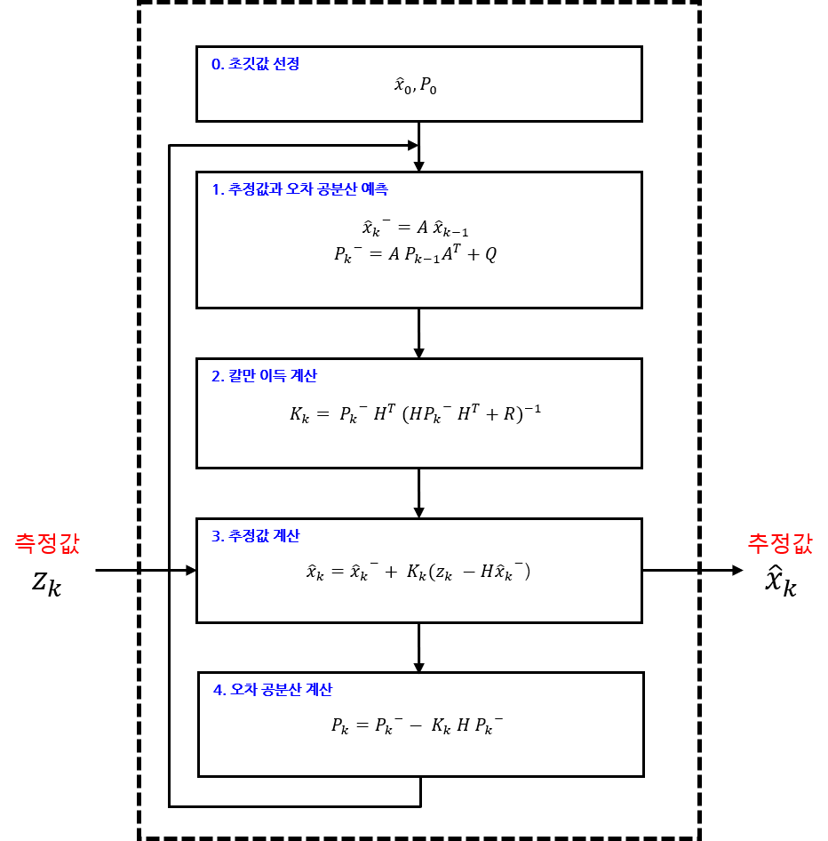

# 2주차 현장실습

휴대용 SAM 시스템은 유도 방식에 따라 크게 지령유도와 호밍유도로 나뉜다. 

유도무기의 용도에 따라 유도 방식이 다 다르다. 

### 1. 최적제어

#### 1. 1 **상태방정식이란?**

상태방정식이란 회로나 각종 시스템에 대해서 미방을 세웠을때 고차 미방에 대해서 1차 미방으로 바꾸어 표현하는 것을 상태방정식이라고 할수 있다. n차 미분방정식을 n개의 1차 미분방정식으로 바꿔 행렬로 표현한것이라고 할수 있다.

 <u>상태 (State)</u>

 \- 어떤 시점(t=t0)에서의 변수를 알고, 시간이 지난 어느 시점(t >= t0)에서의 입력을 알면, 입력이 주어진 시점(t >= t0)에서 시스템의 거동을 완전히 결정할 수 있을 때, 이러한 변수(상태변수)들의 최소집합을 말한다. 

<u>상태변수 (State Variable)</u>

 \- 동적시스템의 상태변수는 동적시스템의 상태를 결정할 수 있는 최소개수의 변수들이다. 

<u>상태벡터 (State Vector)</u>

 \- 주어진 시스템의 거동을 표현하기 위해 n개의 상태변수가 필요하다면, 이 n개의 변수를 벡터 **x** 의 n개의 성분으로 생각할 수 있다. 이러한 벡터를 상태벡터(State Vector)라고 한다. 즉, 상태(State)를 벡터형태(1 x n 행렬)로 나타낸 것이다. 

ex) 3개의 상태변수가 존재한다면,

n1, n2, n3는 상태변수(State Variable)이다.

<u>상태공간 (State Space)</u>

 \- 좌표축이 x1, x2, ... xn 축으로 구성된 n차원의 공간을 상태공간(State Space)이라고 한다. 하나의 상태는 상태공간에서 한 점을 의미한다. 

ex) 

\- 2차원의 상태공간에서 상태: [2, 3] --> x1축에 한 점(2), x2축에 한 점(3).

\- 4차원의 상태공간에서 상태: [3, 5, 4, 7] --> x1축에 한 점(3), x2축에 한 점(5), x3축에 한 점(4), x4축에 한 점(7).

위의 그림은 mass-spring system을 나타내는 그림이다. 마찰력이 없는 바퀴가 달려있고 무게가 m인 수레는 탄성계수가 k인 스프링에 의해 벽과 연결되어 있으며 Fa의 힘으로 오른쪽 방향으로 당겨지고 있다. 수레가 움직인 거리는 x로 나타내었다. mass-spring system의 dynamics(동역학식)는 다음과 같다.

   

외부힘 Fa를 제어입력 u라고 생각한다. 

   
우리는 현재의 위치 및 속도 등의 상태**(x1, x2)**와 시스템의 모델**(A, B)**을 알고 있으면, 적절한 제어입력을 선택하여 다음 상태의 속도와 가속도**(x1_dot, x2_dot)**를 결정할 수 있다. 즉, 제어입력 u를 잘 선택하면 위의 mass-spring system에서의 수레의 속도 및 가속도를 결	정하여 수레를 원하는 위치로 이동시킬 수 있다는 것이다. <수레(시스템)를 원하는 위치에 가져다 놓는 것> 이것을 우리는 수레(시스템)의 위치를 제어한다고 말한다. 

#### 1.2 대표적인 제어 방법

시스템이 빠르고 정확하게 원하는 위치하도록 하는 제어 방법은 크게 Output feedback control과 State feedback control 이 있다. 

1. **Output feedback control**
   Output feedback control은 현재의 상태를 센서로 측정하고, 이를 되먹임(feedback)하여 제어하는 방법이다. 우리가 가장 많이 사용하는 PID controller가 Output feedback controller에 해당한다.

   
   x`센서에서 측정한 현재의 상태 y(t)와 원하는 위치 r(t)와의 차이 e(t)와 e(t)를 적분 및 미분한 값에 각각 Kp, Ki, 그리고 Kd의 PID 게인을 곱하여 제어 입력으로 사용하는 방법이다. 위의 수식에서 표현된 것처럼 Output feedback control은 시스템의 모델(A, B) 없이 제어할 수 있는 장점이 있다. 시스템이 원하는 위치에 도달하면 r(t) = y(t) 이기 때문에 e(t) = 0 이 되고, 제어 입력 u(t) = 0 [e(t) = 0, 미분(e(t)) = 0, 적분(e(t)) = 0] 이 되기 때문에 시스템은 움직이지 않는다.
   
2. **State feedback control**
   State feedback control은 말 그대로 시스템의 상태를 되먹임(feedback)하여 제어하는 방법이다. 
   

   시스템 모델(A, B)는 변하지 않는 값이기 때문에, 우리는 K를 적절히 결정해서 시스템이 어떤 속도와 가속도로 움직여야 할지 조절할 수 있다. State feedback control의 performance는 Output feedback control의 PID 게인을 어떻게 조절하는지에 따라 달라진 것처럼, K를 어떻게 조절하는지에 따라 결정된다. 하지만, Output feedback control과 비교되는 가장 큰 장점은 trial and error 방법을 이용해 K를 구하는 것이 아니라, 시스템 모델(A, B)을 이용해서 K를 결정할 수 있다는 점이다. 즉, 모델만 정확하다면 optimal 한 K를 계산할 수 있어서 게인 값을 찾는데 드는 시간을 줄일 수 있다.

#### 1.3 Lyapunov function 

State feedback control의 장점은 모델만 정확하다면 optimal한 K를 계산할 수 있어서 게인 값을 찾는데 드는 시간을 줄일 수 있다는 것입니다. 그럼 State feedback control에서 K는 어떻게 계산할 수 있을까요? 본 포스팅에서는 optimal value를 구하는데 사용하는 Lyapunov function에 대해 알아보겠다. 

**시스템의 stability를 판정하는 방법은 다음과 같다.**

1. Solution, State transition matrix를 구해서 stability를 판별하는 방법
   - Linear dynamical system의 general solution을 구하는데 사용.

2. Eigenvalue check
   - System의 eigenvalue가 positive real part에 있으면 unstable, nagative real part에 있으면 stable.

3. Lyapunov function
   - Loss function의 미분값이 음수(-)가 되도록 설계하여 항상 Loss function의 최소값을 구하는 방법

System이 주어지면 이미 solution이 define되어 있기 때문에, 모든 solution을 그리면 시스템이 stable한지 판별할 수 있다. 하지만 모든 solution을 구하는 것은 너무 비효율적이다.  Lyapunov function은 solution을 구하지 않고 안정도를 판별할 수 있는 방법이다.

산속에서 길을 잃었을 때, 산 아래로 내려가는 가장 직관적인 방법은 내리막길로 이동하는 것이다. 이와 마찬가지로, 줄이려고 하는 값(error 등)을 변수로 하는 Loss function을 만들고 그 미분값이 항상 음수(-)가 되도록 설계하면 시간이 지날수록 Loss function은 최소값에 도달하게 될 것이다. 즉, 모든 x에 대해서 등고선 함수의 미분값 V_dot(x) < 0 (단, x!=0)을 보일 수 있다면, 초기값이 어디에 위치하든 Loss function이 최소가 되는 게인값 K를 찾을 수 있다.

예를 들어 아래와 같은 시스템을 제어해야 한다라고 가정하자.

1. Loss Function을 다음과 같이 정의한다. 여기서 V(x)를 Lyapunov function이라고 한다.
   
   transpose(x)는 fat 행렬(가로로 긴 행렬), P는 정방행렬, 그리고 x는 tall 행렬(세로로 긴 행렬)이다. 그리고 P 행렬은 positive definite (matrix) 이다. 즉, non-zero colume vecotr x와 transpose(x) 사이에 positive definite P를 multiplication(행렬곱)하면 오목한 모양의 그래프를 얻을 수 있는데, V(x)를 오목한 모양이 되도록 설계한다. 
2. 그럼 설계한 V(x)를 x로 미분한다.
   
3. 우리는 V_dot(x) < 0 으로 만들기 위해서는 V_dot(x)를 다음과 같이 설계하면 된다. 
   
   A는 시스템의 모델이기 때문에 이미 주어져 있다. 따라서 Lyapunov equation Q가 negative definite가 되도록 적절한 P (positive definite)를 설정하면 시간이 지날수록 V(x)의 값이 줄어들도록 할 수 있다(항상 0으로 수렴하는 것은 아니지만, 0으로 수렴할 가능성도 가지고 있다).

#### 1.4 Algebraic Riccati Equation (ARE)

위에서  Lyapunov function에서 Loss function의 값이 줄어들게 하기 위해선 최적의 P값을 설정해야 한다. 
본 포스팅에서는 Algebraic Riccati Eqeation (ARE)를 증명하는 방법을 공유하도록 하겠습니다. 조금 복잡한 수식이 나올 수 있습니다. 하지만 증명을 하기 위해 사용하는 복잡한 수식은 그저 증명을 위한 도구로만 사용하는 것입니다. 수식에 대한 정확한 의미보다는 조금 복잡하지만 유용한 수학적 도구가 있는데 그것을 사용해서 우리가 증명하고자 하는 문제를 해결한다고 생각하시면 됩니다.

우리가 제어하고자 하는 시스템의 상태 방정식이다. 

최적의 제어 입력을 시스템에 주기 위해서는 최적의 게인 K를 계산해야 한다. 우리는 Lyapunov function [V(x)]을 설계하고 Lyapunove equation(A'P+PA)이 negative definite가 되도록 P(positive definite)를 설계하면 시간이 지날수록 V(x)가 줄어든다는 것을 알고 있다. 그러면 우리가 알고 있는 상태 방정식을 기반으로 Lyapunove function [V(x)]를 설계한다. 우리가 원하는 것은 2가지다. 하나는 상태(위치, 속도 등)가 0으로 수렴하는 것, 다른 하나는 상태를 수렴시키기 위해 필요한 제어 입력을 최소로 하는 것이다. 전기자동차로 원하는 위치까지 이동할 때 전기를 조금만 소비하면 돈을 절약할 수 있으니까. 다음과 같이 Lyapunov function을 설계하였다.

""우리가 처음에 해결하려고 했던 문제는 주어진 시스템(상태 방정식)을 제어하는 것이고, 시스템을 제어하기 위한 최적의 게인 K를 찾는 것이였다. 현재 이 문제는 위에서 계산한 적분식의 값이 최소가 되는 u를 구하는 문제로 치환되었다."

**치환된 문제**: 적분식을 최소로 만드는 최적의 u값을 찾는 문제

따라서 치환된 문제를 해결하면 우리가 처음에 즉면했던 문제를 해결하는 것이다. 치환된 문제를 해결하는 방법은 다음의 4가지가 있다.

1. EL(Euler-Lagrange) Formulation

2. HJB(Hamilton-Jacobian-Bellman) Formulation

3. Variational Approach

4. LMI(Linear Matrix Ineqalities) Formulation

- EL Formulation은 아래와 같은 적분식에 대해서, H를 위와 같이 정의하면, 3개의 Euler-Lagrange Equations이 주어진다라는 
  내용이다. 

  

- EL Formulation에서 해결하려고 하는 문제와 비슷하다. 우리는 우리의 문제를 EL Formulation에 나와있는 것처럼 H를 정의하고 Euler-Lagrange Equations을 정의하였다.

  

- 여기 람다는 P(t)x(t)입니다. 람다를 미분하고, 미분 값을 EL(2)와 같다고 놓고 정리하면, 우리는 앞의 포스팅에서 보여드렸던 ARE와 비슷한 모양의 수식을 얻게 됩니다. 이 결괏값을 "Riccati Differential Equation"이라고 합니다. 

  

   										

  

- 시간이 무한대가 되면 변수들은 변화를 멈추고 정상상태에 도달할 것이기 때문에 P_dot은 0이 됩니다. 따라서 정상상태를 가정하면 우리는 다음과 같은 식을 얻을 수 있습니다.

### 2. 칼만 필터

#### <u>2.1 평균 필터</u>

$$
x_k = \frac{x_1+x_2+\cdot\cdot\cdot + x_k}{k}
$$

평균은 데이터의 총합을 데이터 개수로 나눈 값을 말한다. 평균 같은 경우 데이터가 하나 더 추가된다면 모든 데이터를 다시 더한 후 k+1로 나눠야한다. 

그래서 재귀식으로 나타내었다. 
$$
\overline{x_k} = \frac{k-1}{k}x_k+ \frac{1}{k}x_k
$$

#### <u>2.2 이동평균 필터</u>

평균을 취하면 측정 데이터에서 잡음을 제거할 수 있다. 하지만 측정하려는 물리량이 시간에 따라 변하는 경우, 평균을 취하는 건 적절하지 않다. 평균은 데이터의 동적인 변화를 모두 없애버리고 측정 데이터를 뭉뚱그려 하나의 값만 내놓기 때문이다,

잡음을 없애는 동시에 시스템의 동적인 변화를 반영하는 방법이 이동평균 필터이다. 
$$
\overline{x_k} = \overline{x_{k-1}} + \frac{x_k-x_{k-n}}{n}
$$

- 이동평균에서는 평균 계산에 동웒는 데이터 개수(n)를 잘 선정해야 한다. 이 값이 잡음 제거와 변화 민감성이라는 상충된 요구를 절충하는 역할을 한다. 
- 측정하는 물리량이 빠르다면 이동평균의 데이터 개수를 줄여 변화를 빨리 쫓아가야한다.
- 측정하는 물리량이 느리다면 데이터 개수를 늘려 잡음 제거 특성을 높여야한다.

단점

- 식을 보면 모든 데이터에 동일한 가중치(1/n)를 부여한다. 가장 최근의 데이터와 가장 오래된 데이터를 같은 비중으로 평균에 반영한다. 이동평균 필터를 변화가 심한 신호에 적용하면, 잡음 제거와 변화 민감성을 동시에 달성하기 어렵다. 

#### <u>2.3 저주파 통과 필터</u>

저주파 통과 필터는 이름 그대로 저주파 신호는 통과시키고 고주파 신호는 걸러내는 필터를 말한다.
대개 측정하려는 신호는 저주파이고 잡음은 고주파 성분으로 되어 있어 잡음 제거용으로 많이 쓰인다.
$$
\overline{x_k} = \alpha\overline{x}_{k-1}+ (1-\alpha)x_k
$$

- a값이 작으면 추정값 계산에 측정값이 더 많이 반영되는 거다. 이렇게 되면 저주파 통과 필터는 잡음 제거보다는 측정값의 변화에 더 민감해진다. 그래서 잡음이 더 많은 것이다. 	
- a값이 커지면 추정값의 비중이 더 커져서 결과적으로 추정값이 직전 추정값과 별로 달라지지 않게 되는 샘이다. 그래서 잡음이 줄어들고 추정값 그래프의 변화가 무뎌진다.

$$
\overline{x}_{k-1} = \alpha\overline{x}_{k-2}+ (1-\alpha)x_{k-1}
$$

위에서 봤던 평균 필터의 식과 비슷하지만 같지 않다. XkBar는 평균값이 아닌 추정값(estimated value)이다. 
여기서 a는 0<a<1인 임의의 상수이다. 
$$
x_k=α\overline{x_{k−1}}+(1−α)x_k
$$

$$
=α [{α\overline{x}_{k-2}+(1−α)x_{k−1}}]+(1−α)x_k
$$

$$
=α^2{\overline{x}_{k-2}+α(1−α)x_{k−1}}+(1−α)x_k
$$

여기서 측정데이터 Xk-1, Xk이 곱해진 계수의 크기를 비교하였을 때 이전값보다 최근 측정값이 더 큰 가중치를 부여 받아 추정값에 반영되고 있음을 알 수 있다. 

#### <u>2.4 칼만 필터</u>

위와 같이 입력과 출력이 하나씩인 아주 간단한 구조로, 측정값 (Zk)이 입력되면 내부에서 처리한 다음 추정값을 출력한다. 내부 계산은 총 네 단계에 걸쳐 이뤄진다.

